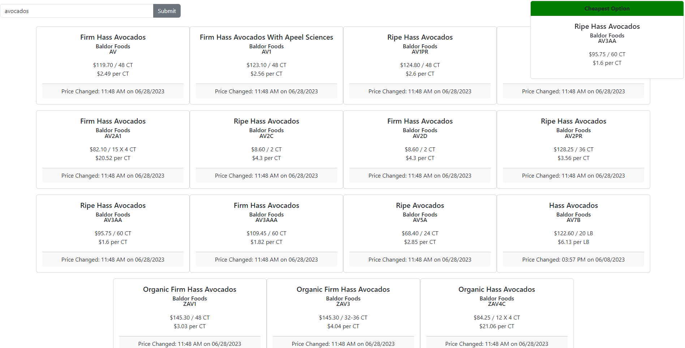

# Vendor Price Comparison




## Introduction

This is a full-stack web application focused on comparing product pricing across different vendors for resturants


In order to run the app you must:

1. Run ```pipenv install; pipenv shell``` in the CLI
2. Navigate to chef-price-comp/chef_comp and run ```python app.py ``` to start the database
3. In a different terminal, navigate to chef-price-comp/client and run ``` npm install && npm start ``` to start the front end


